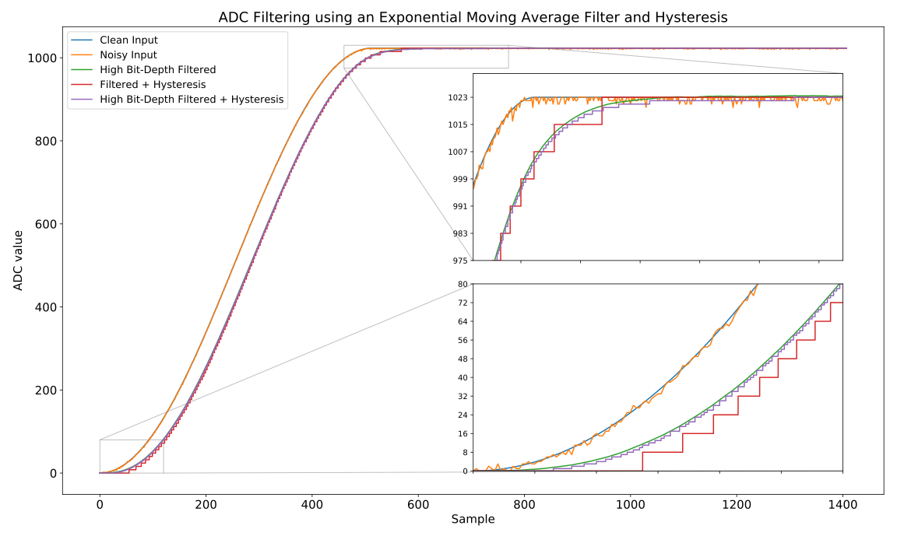

# Arduino ADC Filter Hysteresis

Use an efficient digital exponential moving average single-pole filter combined
with hysteresis to filter the analog inputs of an Arduino.

Ideal for responsive potentiometers etc.

